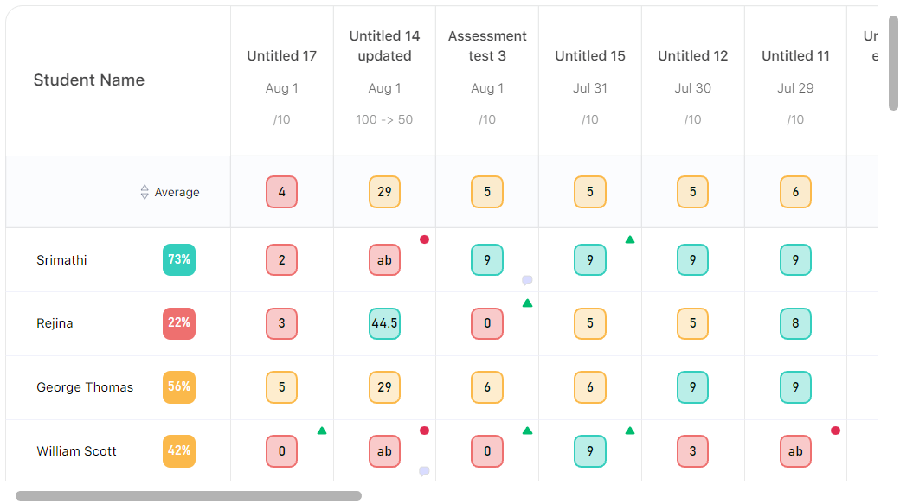
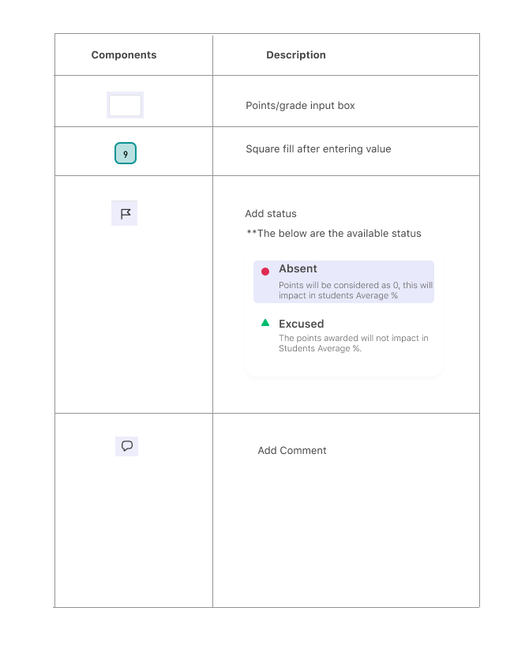

# Gradebook
### Gradebook table



* Entry point our app is `getClassRoom` from `action-reducers/teacher/classDetails`. From this function, we will fetch all classroom assocaited to the teacher and then update the store.

* the second most important api is, `getClassDetails` from `action-reducers/teacher/classDetails`. From this function, we will fetch all details related to the classroom like students list, assessment lists, students marks, grade scale for the class. After fetching the data, we will manuplate the data and then update our store.


the folloowing is the response structure,
```js
let respose = {
  allAssessmentDetails: [{
    assessmentTest: [{
      assessmentTestId: "",
      assessmentTestName: "",
      gradeColor: "",
      grade: "",
      marksObtained: "",
      percentage: "",
      testStatus: "",
      testComment: "",
    }],
    studentId: "",
    studentName: "",
  }],
  assessmentDetails: [{
    id: "",
    assessmentTitle: "",
    totalPoints: "",
    assessmentDate: "",
    markingSystem: "",
    convertTo: "",
    isIncludedInFinal: "",
    assessmentAverage: 0,
  }],
  defaultGradeScale: {
    gradeId: "",
    gradeName: "",
    gradeScaleConditions: [{
      id: "",
      gradePoints: "",
      gradeLetter: "",
      gradeLowerRange: "",
      gradeHigherRange: "",
      gradeColor: "",
      gradeOrder: 0,
    }]
  },
  allStudents: [{
    studentAverage: 0,
    studentName: "",
    studentId: "",
  }],
}
```

For ease of use and to make the data to be processable in ui and to be in correct format of data as frontend needed, we manuplate the data. Structure of the teacher store is given below,

```js
const initialState = {
  list: [], // all classroom list
  isListLoaded: false, // whether we fetched the all classroom list or not

  pendingReq: {}, // pending students list

  // from `getClassDetails` data splited and stored seperately
  studentData: {},
  gradeScaleData: {},
  assessmentData: {},
  studentAssessmentData: {},
  loadedSections: {}
}
```

All objects are in the same type, like each data is stored by `sectionId` as key and their data is stored as value for that. While storing data as mentioned, `loadedSections` is set to `true` for that `sectionId`.

#### Data manuplation

1. get data from api

```js
  const {
    allStudents, // student list
    assessmentDetails, // assessment list
    allAssessmentDetails, // student marks in assessments
    defaultGradeScale, // grade scale details
  } = responseData
```

2. sort assessmentDetails by date

```js
  assessmentDetails.sort((a, b) => new Date(a.assessmentDate).getTime() < new Date(b.assessmentDate).getTime() ? 1 : -1)
```

3. While initial develpoment on backend, student data is splited as `roster` and `normal` student and thier assessment details are stored with diffrent names. So we have to combine and change the name of fields, and add some data to help to render ui of the gradebook table (will be explained seperately). 

```js
  const studentAssessmentData = allAssessmentDetails.map(assessment => ({
    id: assessment.id || assessment.studentId, // student id can be just id or studentId
    studentName: assessment.studentName,
    assessmentTestForRoster: assessmentDetails.reduce((prev, current) => {
      const assessmentTest = assessment.assessmentTestForRoster || assessment.assessmentTest
      const details = assessmentTest.find(test => test.assessmentTestId === current.id)
      if (details) {
        prev.push({
          ...current,
          ...details
        })
      } else {
        prev.push({
          ...current,
          assessmentTestId: current.id,
          marksObtained: "-1",
          percentage: "-1",
          grade: "-1",
        })
      }

      return prev
    }, [])
  }))
```

As said before, assessment details name is saved differently, so we assign it as `assessmentTestForRoster`. then we are going to create a array for the student marks by assessment using `assessmentDetails` reduce method. If assessment id present in `assessmentTest` then teacher assigned mark to that test, if not we will add dummy data like above. 

4. After that we loop through student data once again. Since some students may not hav any marks assigned previously. like above same structure followed.

```js
  allStudents.forEach(stu => {
    const isPresent = studentAssessmentData.some(stAs => stAs.id === stu.studentId || stAs.id === stu.id)

    if (!isPresent) {
      const newData = {
        id: stu.studentId || stu.id,
        studentName: stu.studentName,
        assessmentTestForRoster: assessmentDetails.map(assessment => ({
          ...assessment,
          assessmentTestId: assessment.id,
          marksObtained: "-1",
          percentage: "-1",
          grade: "-1",
        })),
      }

      studentAssessmentData.push(newData)
    }
  })
```

5. Finally, we will update the gradescale data. 

```js
  const gradeScaleData = {
    gradeId: defaultGradeScale.gradeId,
    gradeName: titleDecider(defaultGradeScale.gradeName),
    gradeScaleConditions: defaultGradeScale.gradeScaleConditions
      .map(gr => ({
        ...gr,
        gradeHigherRange: Number(gr.gradeHigherRange),
        gradeLowerRange: Number(gr.gradeLowerRange),
        gradePoints: Number(gr.gradePoints),
      }))
      .sort((a, b) => a.gradeOrder > b.gradeOrder ? 1 : -1)
  }
```

For some `gradeNames`, we are using other names like `point/percentage` is called `Default (Points/Percentage)`. So for handling that, we are using `titleDecider` function. `gradeScaleConditions` are not in correct order from backend, so we are sortig that data. And Finally we save all data to store.


### Gradebook ui logics
The gradebook tab elated code all put together under `comp/Teacher/Gradebook`. `comp/Teacher/Gradebook/Table` is the heart of the gradebook.

1. `comp/Teacher/Gradebook`
We get `studentAssessmentList`, `assessmentList`, `currentGradeScaleCondition` and other data from the store. And store the other conditions as state like, `displayAsPoint`, `filterByDate`, `sortBy`, `checked`, etc.

Then we create `gradeToMidPoints`, `gradeLettersOnly` from `currentGradeScaleCondition`. 

Then we calculate, update and filter data (`[assessmentData, studentAssessmentData, avgScore]`) from the following useMemo, 

```js
  const [assessmentData, studentAssessmentData, avgScore] = useMemo(() => {
    let newstudentAssessmentData = studentAssessmentList.map(p => ({
      ...p,
      avg: 0
    }))
    let newAssessmentData = assessmentList.map(p => p)

    if (checked.length > 0) {
      newAssessmentData = newAssessmentData.filter(li => checked.includes(li.id))
      newstudentAssessmentData = newstudentAssessmentData.map(li => ({
        ...li,
        assessmentTestForRoster: li.assessmentTestForRoster.filter(l => checked.includes(l.assessmentTestId))
      }))
    }

    if (filterByDate === "This week" || filterByDate === "Last week") {
      const toDate = filterByDate === "This week" ? new Date() : sub(new Date(), { days: 7 })
      newAssessmentData = newAssessmentData.filter(li => isSameWeek(new Date(li.assessmentDate), toDate))
      newstudentAssessmentData = newstudentAssessmentData.map(li => ({
        ...li,
        assessmentTestForRoster: li.assessmentTestForRoster.filter(l => isSameWeek(new Date(l.assessmentDate), toDate))
      }))
    }

    if (filterByDate === "This month" || filterByDate === "Last month") {
      const toDate = filterByDate === "This month" ? new Date() : sub(new Date(), { months: 1 })
      newAssessmentData = newAssessmentData.filter(li => isSameMonth(new Date(li.assessmentDate), toDate))
      newstudentAssessmentData = newstudentAssessmentData.map(li => ({
        ...li,
        assessmentTestForRoster: li.assessmentTestForRoster.filter(l => isSameMonth(new Date(l.assessmentDate), toDate))
      }))
    }

    if (filterByDate === "Last three months") {
      const today = new Date()
      const start = startOfMonth(sub(today, { months: 3 }))
      const end = endOfMonth(sub(today, { months: 1 }))

      newAssessmentData = newAssessmentData.filter(li => isWithinInterval(new Date(li.assessmentDate), { start, end }))
      newstudentAssessmentData = newstudentAssessmentData.map(li => ({
        ...li,
        assessmentTestForRoster: li.assessmentTestForRoster.filter(l => isWithinInterval(new Date(l.assessmentDate), { start, end }))
      }))
    }

    let assessMentAvg = findAvgPercentForAssessments(newAssessmentData, studentAssessmentList, gradeToMidPoints, currentGradeScaleCondition)

    newstudentAssessmentData.forEach(f => {
      if (f.assessmentTestForRoster.length > 0) {
        f.avg = findAvgPercentForStudent(f.assessmentTestForRoster)
      }
    })

    if (sortBy === "asc") {
      newstudentAssessmentData = newstudentAssessmentData.sort((a, b) => a.avg < b.avg ? 1 : -1)
    }

    if (sortBy === "desc") {
      newstudentAssessmentData = newstudentAssessmentData.sort((a, b) => a.avg > b.avg ? 1 : -1)
    }

    return [newAssessmentData, newstudentAssessmentData, assessMentAvg]
  }, [assessmentList, studentAssessmentList, checked, sortBy, filterByDate, gradeToMidPoints, currentGradeScaleCondition])
```

We are calculating average score for assessment as well as student in the useMemo using `findAvgPercentForAssessments` and `findAvgPercentForStudent` function respectively.

* `-1` is used dummy placeholder for graebook cell in all places. we have added that while storing data.

##### `findAvgPercentForStudent`
Simple function which accepts the assessment list as parameter and return the average value for the list. 
  - calculate total percentage.
  - find average by dividing total by length of the assessment.

#### `findAvgPercentForAssessments`
Function which return array of object to represent the average row of the gradebook table. We need to show different data as respective to `Display as` option.

parameters are assessments, studentAssessmentList, gradeToMidPoints, currentGradeScaleCondition

We are going to return new array based on assessments (using reduce method). 
  - Iterate `assessments` 
  - based on current iterator we will filter out all student marks from `studentAssessmentList`. After finding all assessment by assessment column in studentAssessmentList, we will return `{ mark, percentage, grade }` as array.
  - add all data, get total length, calculate percentage using first two values.
  - return `{ markingSystem, percentage, grade, mark, id }` as array.

Notable points, 
  - based on `markingSystem` we decide `{ mark, percentage, grade }`
  - `-1` as taken as validator, if the value matches i.e `-1` === `mark|percentage|grade` then we will return min value like `0|""`
  - `markToGrade` and `gradeToMark` function used wherver they needed.


2. `comp/Teacher/Gradebook/Table`
We get data from props which is used to render table ui.

```
  assessmentData -> first row, assessment details row
  avgScore -> second row, average row
  studentAssessmentData -> other rows, student name and thier marks according to assessment order
```

Each array is used with different components. `assessmentData` is mapped with `<HeadTr />`, `avgScore` is mapped with `<Mark />`, `studentAssessmentData` is mapped with `<Profile />` and its `assessmentTestForRoster` property is mapped with `MarkInput />`. `MarkInput />` is breaked into several individual components.

`<HeadTr />`, `<Mark />`, `<Profile />` are just ui components.


### MarkInput 


Props are self explanatory as the name suggest. `i` and `j` are the props which represent the placement in the table cell.

```js
  const [final, setFinal] = useState(markingSystem === "0" ? Number(mark) : mark)
```

We will render different input boxes based on the requirement. 
- If `final` === -1 (number) then => `PointInputBox`.
- If `final` === -1 (number) and `convertTo` > 0 then => `ConvertToPointBox`.
- If `final` === -1 (text) then => `GradeInputBox`.
- If `final` is not -1, then we will show the colored mark boxes.


```js
  // input value of the input box
  const [val, setVal] = useState(
    stuTestStatus === "1"
      ? "ab"
      : mark === "-1"
        ? ""
        : markingSystem === "0"
          ? convertTo > 0
            ? Number(Number(Number(mark) * (total / convertTo)).toFixed())
            : Number(mark)
          : mark
  )
```

Other functions explanations,
```js
  // number input updater
  const onChangeByPoint = () => {}

  // grade letter input updater
  const onChangeByGrade = () => {}

  // check the input is valid to be enter as mark
  const canProceed = () => {}

  // onBlur -> fires on on blur of every input type. will make backend call only when the value changes.
  const onBlur = () => {}

  // onEnter -> fires when user pressed enter key
  const onEnter = () => {}

  // fires when onclicking the cell
  const onReEnter = () => {}

  // set the cell to be in focus
  const stayFocus = () => {}

  // on submiting, flag icon input (updating test status)
  const onFlagOptionClk = () => {}

  // on making comment for the cell
  const makePost = () => {}
```

`PointInputBox` , `ConvertToPointBox`, `GradeInputBox` are all same in logical wise which are used to update the input box and if the value is not fit to our condition then will fire error popup. In throughout our application `react-aria` is used `GradeInputBox` for select like input box. `PointInputBox` , `ConvertToPointBox`, `CommentBox`, `TestStatusBox` are using `@floating-ui/react-dom-interactions` library for placing the error popups. Infact most of the places we use `@floating-ui/react-dom-interactions` library. It is advised to learn this library before start working on.


